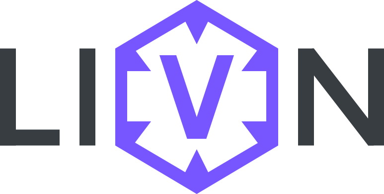

# LIVON



**Live Input. Vector Output. Nodes.**

LIVON is an HTTP-native, reactive event orchestration system for modern microservice architectures.
It runs without a message broker by default, using WebSocket for real-time delivery – but is designed to support external systems like **MongoDB**, **Kafka**, **Redis Streams**, **RabbitMQ**, and others via modular adapters.

> Built with TypeScript · Streaming over WebSocket · Functional & Extensible

> ⚠️ **Note:** LIVON is in an early development stage and currently not functional. Most core features are still under development. Expect breaking changes and incomplete functionality.

---

## 🔍 What is LIVON?

One of LIVON's core design goals is to ensure that the **syntax is identical on both server and client side**. This allows developers to reuse the same event definitions and logic across the full stack – enabling true fullstack event-driven development with shared types, shared validation, and shared handlers.

**LIVON** stands for:

> **Live Input · Vector Output · Nodes**

LIVON provides a brokerless, stream-based event runtime that:

* Streams events between services in real time
* Supports multiple subscribers per event
* Handles retries and acknowledgements
* Works entirely over HTTP and WebSocket
* Integrates with any HTTP framework (Express, Fastify, tSED...) via forwarding
* Is fully type-safe, modular, and built for Clean Code

---

## 🧱 Architecture Overview

```plaintext
+------------+            +------------+
| Publisher  |            | Subscriber |
| (Service)  |            | (Service)  |
+------------+            +------------+
      |                         ^
   WS | STREAM                  |
      v                         |
  +----------+      STREAM      |
  |  LIVON   |------------------+
  | Runtime  |        WS        |
  +----------+
```

---

### ✅ Key Features

* **No brokers, no Redis** – runs over HTTP only
* **Change Stream-based** for real-time processing
* **Pluggable storage**: MongoDB first, Kafka/Redis support to follow
* **Dead Letter Queue** with configurable retry strategies
* **Event decorators** for seamless framework integration (tSED, Express, CLI)
* **Swagger-inspired JSON spec** for event documentation and tooling
* **Fully functional TypeScript** with strict typing and modular architecture

---

## 🚀 Getting Started

### Prerequisites

* Node.js v18+
* pnpm (`npm i -g pnpm`)

### Install

**Server:**

```bash
pnpm add @livon/core @livon/schema @livon/transport-ws-server
```

**Client:**

```bash
pnpm add @livon/core @livon/schema @livon/transport-ws-client
```

### Start Dev Server

```bash
pnpm install
pnpm run dev
```

---

## 📆 Package Structure

```plaintext
apps/
├── demo-client/           # Example client using WebSocket transport
├── demo-gateway/          # Gateway dispatcher (optional)
└── demo-service/          # Example microservice subscribing to events

packages/
├── core/                  # Core runtime, dispatch, retry, DLQ
├── storage-*/             # Storage adapters (MongoDB, Kafka, etc.)
├── transport-*/           # HTTP framework adapters (Express, WS, etc.)
├── decorators/            # @EventListener, @EventSchema decorators
├── schema/                # Zero-dependency schema definitions (pure TypeScript)
└── docs/                  # Swagger-inspired JSON doc generator
```

---

## 📘 Roadmap

* WebSocket Client transporter
* WebSocket Server transporter
* Type-safe Schema generation
* Gateway implementation
* MongoDB storage adapter
* Dead Letter Queue
* Fastify & tSED decorators
* Swagger-inspired Event Explorer UI
* Real-time Data Flow Visualization

---

## ✨ Philosophy

LIVON is built with:

* **Functional programming** (no classes unless essential)
* **One-parameter functions** using typed input objects
* **Strict typing** with no `any`, no `unknown`, no unsafe casts
* **Pure TypeScript** with zero runtime dependencies in schema
* **Clean architecture** and minimal coupling
* **Explicit data flow** – no inline logic or side effects

---

## 📄 License

MIT © 2025 LIVON

