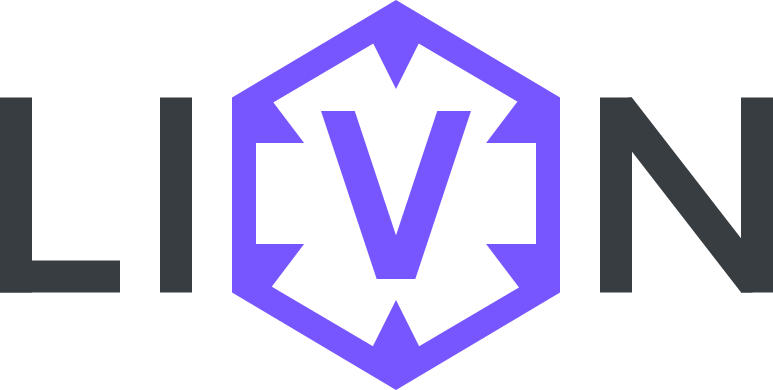

# LIVON

  

  
  
  
  
  

LIVON (Live Input Vector Output Node) is a TypeScript framework for building APIs that frontend and backend teams can share, including real-time communication.

## Package Badges

| Package | version | dependencies | code quality | package size | license |
| --- | --- | --- | --- | --- | --- |
| `@livon/runtime` |  |  |  |  |  |
| `@livon/schema` |  |  |  |  |  |
| `@livon/client` |  |  |  |  |  |
| `@livon/client-ws-transport` |  |  |  |  |  |
| `@livon/node-ws-transport` |  |  |  |  |  |
| `@livon/dlq-module` |  |  |  |  |  |
| `@livon/config` |  |  |  |  |  |
| `@livon/cli` |  |  |  |  |  |
| `@livon/sync` |  |  |  |  |  |
| `@livon/react` |  |  |  |  |  |

## What Is LIVON?

LIVON helps you build APIs once and use them on both backend and frontend.
You define your API schema in one place, and LIVON keeps client and server in sync.
It is designed for both request/response flows and real-time event streams.

## Why LIVON?

- One shared API schema for server and client
- Real-time events and API calls in one consistent model
- Fewer integration bugs between frontend and backend
- Strong TypeScript support out of the box
- Works for backend, frontend, and fullstack teams

## How Is LIVON Different from Other Tools?

Many tools solve only one part (validation, transport, or API calls).
LIVON combines these pieces so your team can move faster with less glue code.

## Quick Links (GitHub Pages)

- Documentation Home: https://livon.tech/docs
- Why Livon Exists: https://livon.tech/docs/core/why-livon-exists
- How LIVON Differs From Other Tools: https://livon.tech/docs/core/why-livon-exists#how-livon-differs-from-other-tools
- For Engineering Managers: https://livon.tech/docs/core/for-managers
- For Frontend Developers: https://livon.tech/docs/core/for-frontend-developers
- For Backend Developers: https://livon.tech/docs/core/for-backend-developers
- For Fullstack Developers: https://livon.tech/docs/core/for-fullstack-developers
- Getting Started: https://livon.tech/docs/core/getting-started
- Runtime Design: https://livon.tech/docs/technical/runtime-design
- Schema APIs: https://livon.tech/docs/schema
- Packages Overview: https://livon.tech/docs/packages
- Contributing: https://livon.tech/docs/core/contributing
