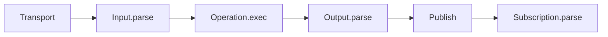

LIVON handlers receive validated data by default.  
Validation is enforced at execution boundaries before business logic runs.

## Runtime lifecycle



## What this guarantees

- `exec` receives input that already passed schema validation.
- output leaves `exec` only after output schema validation.
- published payloads are checked against subscription schema.
- boundary errors surface through runtime error flow, not deep inside domain logic.

## Example: boundary-first execution

```ts
import {and, api, object, operation, string, subscription, union} from '@livon/schema';

const MessageInput = object({
  name: 'MessageInput',
  shape: {
    payload: union({
      name: 'MessagePayload',
      options: [string().min(1), object({name: 'AttachmentPayload', shape: {url: string()}})],
    }),
  },
});

const WithMeta = object({
  name: 'WithMeta',
  shape: {
    id: string(),
  },
});

const Message = and({
  left: MessageInput,
  right: WithMeta,
  name: 'Message',
});

const sendMessage = operation({
  input: MessageInput,
  output: Message,
  exec: async (input) => ({...input, id: 'msg-1'}),
  publish: {
    onMessage: (output) => output,
  },
});

const ChatApi = api({
  operations: {sendMessage},
  subscriptions: {
    onMessage: subscription({payload: Message}),
  },
});
```

### Parameters in this example

`operation({...})`:

- `input` (`Schema`): request schema parsed before `exec`.
- `output` (`Schema`): response schema parsed after `exec`.
- `exec` (`(input, ctx) => result`): operation handler receiving validated input.
- `publish` (`Record<string, (output) => payload>`): event payload mapping after output validation.

`and({...})`:

- `left` / `right` (`Schema`): compose output from reusable parts instead of duplicating field definitions.

`subscription({payload})`:

- `payload` (`Schema`): schema for published event payload.

## Boundary validation error example

```ts
const unknownInput: unknown = {payload: ''};
MessageInput.parse(unknownInput); // throws validation error because min(1) fails
```

In runtime execution, this kind of failure is emitted at the integration point and routed through error handling, instead of failing later inside unrelated business logic.

## Related concepts

- [parse vs typed](parse-vs-typed)
