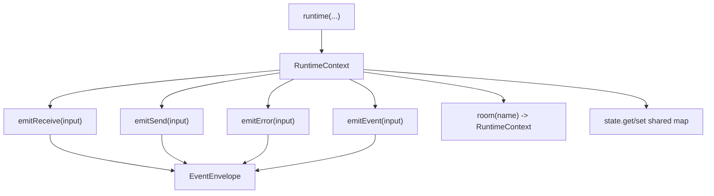
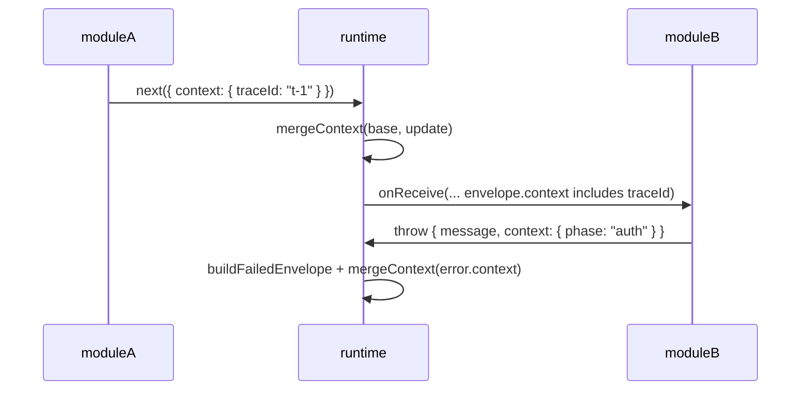

## Install

```sh
pnpm add @livon/runtime
```

## Purpose

[@livon/runtime](/docs/packages/runtime) is the event pipeline core. It composes modules and executes hook chains for:

- `onReceive`
- `onSend`
- `onError`

## Best for

Use this package when you need deterministic event flow orchestration across transports and schema execution.

## Basic usage

```ts
import {runtime} from '@livon/runtime';

runtime(moduleA, moduleB);
```

## Parameters

`runtime(...modules)`:

- `modules` (`RuntimeModule[]`): ordered module list to register and execute.

`RuntimeModule`:

- `name` (`string`): module identifier for debugging and traceability.
- `register` (`(registry) => void`): setup callback where hooks are registered.

## Execution order (important)

Runtime module order defines execution order.

```ts
runtime(moduleA, moduleB, moduleC);
```

Hook chains run from left to right:

1. `moduleA`
2. `moduleB`
3. `moduleC`

This applies to `onReceive`, `onSend`, and `onError` registration order.

## Writing a runtime module

```ts
import type {RuntimeModule} from '@livon/runtime';

const traceModule: RuntimeModule = {
  name: 'trace',
  register: ({onReceive, onSend, onError}) => {
    onReceive(async (envelope, ctx, next) => {
      return next();
    });

    onSend(async (envelope, ctx, next) => {
      return next();
    });

    onError((error, envelope, ctx) => {
      // error handling
    });
  },
};
```

### Hook callback parameters

`onReceive((envelope, ctx, next) => ...)` and `onSend((envelope, ctx, next) => ...)`:

- `envelope` (`EventEnvelope`): current event envelope flowing through the chain.
- `ctx` (`RuntimeContext`): emit APIs, room-scoped context, and shared runtime state.
- `next` (`(update?) => Promise<EventEnvelope>`): continue chain and optionally merge envelope updates.

`onError((error, envelope, ctx) => ...)`:

- `error` (`unknown`): thrown/normalized error from runtime chain.
- `envelope` (`EventEnvelope`): failed envelope snapshot.
- `ctx` (`RuntimeContext`): same runtime context for recovery/reporting logic.

## Runtime context model

`RuntimeContext` (`ctx` in hooks) is runtime control surface.  
It is separate from `envelope.context` (event data flowing through the pipeline).





Rules:

- `ctx.room(name)` creates a room-scoped context that injects `metadata.room`.
- `ctx.state` is shared across room scopes for one runtime instance.
- `envelope.context` is immutable hook input; use `next(update)` to merge context changes.

## Emit APIs in runtime context

Inside hooks/modules you can emit:

- `ctx.emitReceive(...)`
- `ctx.emitSend(...)`
- `ctx.emitError(...)`
- `ctx.emitEvent(...)` (alias to send path)

You can also scope to rooms via `ctx.room(roomId)`.

### Emit input parameters

`emitReceive`, `emitSend`, `emitError`, `emitEvent` all accept one `EmitInput`:

- `event` (`string`, required): event name.
- `payload` (`Uint8Array`, required unless `error` is provided): transport payload.
- `error` (`EventError`, required unless `payload` is provided): error payload.
- `id` (`string`, optional): envelope id override.
- `status` (`'sending' | 'receiving' | 'failed'`, optional): explicit status override.
- `metadata` (`Record<string, unknown>`, optional): routing/correlation metadata.
- `context` (`RuntimeEventContext`, optional): module context object merged across pipeline.

## Related pages

- [Validated by Default](/docs/core/validated-by-default)
- [@livon/schema](schema)
- [Runtime Design](/docs/technical/runtime-design)
- [Event Flow](/docs/technical/event-flow)
