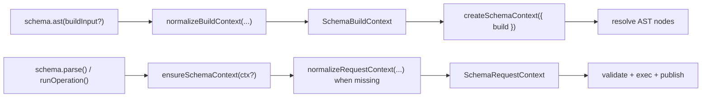
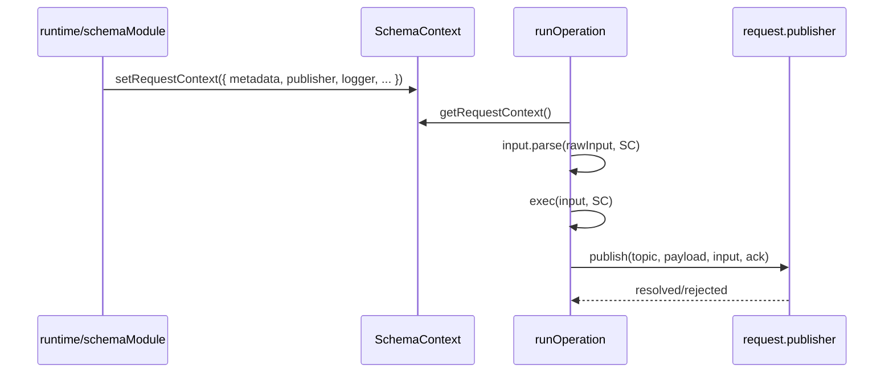

`SchemaContext` separates AST build concerns from runtime request concerns.

It has two context scopes:

- `SchemaBuildContext` for `schema.ast(...)` and AST traversal.
- `SchemaRequestContext` for `parse`, `validate`, `runOperation`, and publish flow.

Both are carried by one `SchemaContext` object:

- `getBuildContext` / `setBuildContext`
- `getRequestContext` / `setRequestContext`
- `state` (shared request-state store)

## Build context and request context flow

## Request execution sequence

## `SchemaBuildContext` fields

- `buildId` (`string`): unique build run id.
- `builder` (`AstBuilder`): collected AST node registry.
- `parentNode` (`AstNode`, optional): parent node while resolving nested schema.
- `schemaPath` (`string[]`): path in schema tree.
- `buildOptions` (`Record<string, unknown>`): custom build-time options.

## `SchemaRequestContext` fields

- `requestId` (`string`): request correlation id for one schema execution.
- `timestamp` (`number`): request start timestamp.
- `correlationId` (`string`, optional): upstream request correlation.
- `sourceId` (`string`, optional): caller/source identifier.
- `userId` (`string`, optional): authenticated user id.
- `tenantId` (`string`, optional): tenant identifier.
- `metadata` (`Record<string, unknown>`, optional): request metadata.
- `state` (`SchemaState`): mutable state store scoped to one request context.
- `publisher` (`Publisher`, optional): publish integration for operation hooks.
- `onPublishError` (`(error, info) => void`, optional): publish failure callback.
- `logger` (`Logger`, optional): structured logging hooks.

## Normalization behavior

- `schema.ast(...)` normalizes build context even if input is partial.
- `schema.parse(...)` and `validate(...)` normalize request context when absent.
- `setRequestContext(...)` preserves the same `state` instance across replacements.
- Build context and request context stay independent and can exist separately.

## Runtime integration

In [`schemaModule`](/docs/packages/schema), each inbound runtime envelope creates or overrides a request context, including metadata and publish wiring.
`envelope.context` (runtime event context) is copied into emitted events, but it is not the same object as `SchemaRequestContext`.

## Related docs

- [Schema Type Safety](type-safety)
- [operation](operation)
- [@livon/runtime](/docs/packages/runtime)
- [Runtime Design](/docs/technical/runtime-design)
