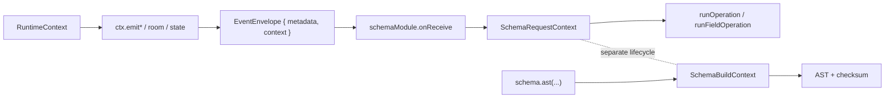
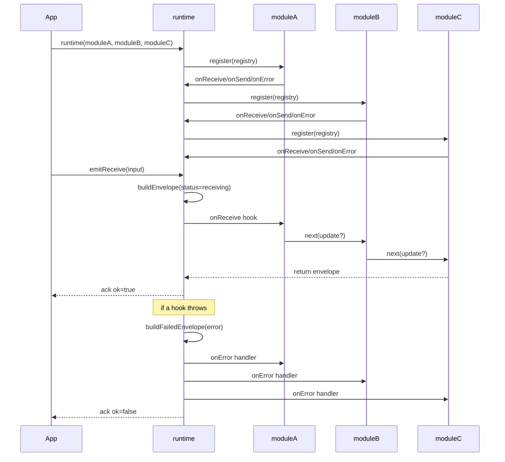

For runtime maintainers, this page documents runtime responsibilities and execution-flow boundaries.

## Goals

- Same runtime composition API on frontend and backend.
- Deterministic event lifecycle hooks.
- Clear separation between runtime, [schema](/docs/schema), and transport concerns.

## Lifecycle hooks

All envelopes flow through:

1. `onReceive` for inbound events.
2. `onSend` for outbound events.
3. `onError` for failure events.

## Context boundaries

LIVON uses three different context models:

1. `RuntimeContext` (`ctx` in runtime hooks) for emit/state/room APIs.
2. `SchemaBuildContext` for AST build resolution (`schema.ast(...)`).
3. `SchemaRequestContext` for parse/exec/publish runtime flow.



`RuntimeContext` is not the same as `SchemaRequestContext`, and neither is the same as `envelope.context`.
See [@livon/runtime](/docs/packages/runtime) and [Schema Context](/docs/schema/context) for field-level details.

## Registry API (`on*`) in modules

Every module registers hooks via `onReceive`, `onSend`, and `onError` (destructured from the registry input).

```ts
import type {RuntimeModule} from '@livon/runtime';

export const traceModule = (): RuntimeModule => ({
  name: 'traceModule',
  register: ({onReceive, onSend, onError}) => {
    onReceive(async (envelope, ctx, next) => {
      return next();
    });

    onSend(async (envelope, ctx, next) => {
      return next();
    });

    onError((error, envelope, ctx) => {
      console.error('runtime error', {
        event: envelope.event,
        status: envelope.status,
        message: error instanceof Error ? error.message : String(error),
      });
    });
  },
});
```

`onReceive` and `onSend` are middleware-style chains (`next(update?)`).
`onError` is a listener list and runs without `next`.

### Parameters in this example

`onReceive((envelope, ctx, next) => ...)` / `onSend((envelope, ctx, next) => ...)`:

- `envelope` (`EventEnvelope`): current event envelope in the hook chain.
- `ctx` (`RuntimeContext`): emit APIs, room scoping, shared runtime state.
- `next` (`(update?) => Promise<EventEnvelope>`): continues chain; optional `update` merges into envelope.

`onError((error, envelope, ctx) => ...)`:

- `error` (`unknown`): thrown/normalized hook error.
- `envelope` (`EventEnvelope`): failed event envelope.
- `ctx` (`RuntimeContext`): runtime context for recovery/logging side effects.

## Runtime composition

Server:

```ts
runtime(
  nodeWsTransport(wsConfig),
  schemaModule(serverSchema),
);
```

Client:

```ts
runtime(
  clientWsTransport(clientWsConfig),
  api,
);
```

### Parameters in this example

`runtime(...modules)`:

- `modules` (`RuntimeModule[]`): ordered module list; order defines hook execution order.

`nodeWsTransport(wsConfig)`:

- `wsConfig` (`NodeWsTransportInput`): websocket server transport configuration.

`schemaModule(serverSchema)`:

- `serverSchema` (`Api | ComposedApi`): [schema](/docs/schema) schema object returned by `api(...)` or `composeApi(...)`.

`clientWsTransport(clientWsConfig)`:

- `clientWsConfig` (`ClientWsTransportInput`): browser websocket transport configuration.

`api`:

- generated client runtime module from [schema AST](/docs/schema).

## Low-level call order

Runtime call order is deterministic and follows module registration order from left to right.

```ts
runtime(moduleA, moduleB, moduleC);
```

Registration order:

1. `moduleA.register(registry)`
2. `moduleB.register(registry)`
3. `moduleC.register(registry)`

Hook execution order for one `emitReceive` call:

1. first `onReceive` hook registered
2. second `onReceive` hook registered
3. ...
4. chain end

Same rule applies to `onSend`.
For `onError`, handlers run in registration order with `forEach`.



## Schema behavior

- Operations can define `input`, `output`, `exec`, `publish`, `rooms`, and `ack`.
- Subscriptions define `payload` and optional `input`, `output`, `filter`, `exec`.
- Generated client keeps operation names symmetric with server.

## Envelope basics

```ts
type EventEnvelope = {
  id: string;
  event: string;
  status: 'sending' | 'receiving' | 'failed';
  metadata?: Readonly<Record<string, unknown>>;
  context?: Readonly<Record<string, unknown>>;
  payload?: Uint8Array;
  error?: {
    message: string;
    name?: string;
    stack?: string;
  };
};
```

## Boundaries

- Runtime orchestrates hooks and event forwarding.
- [Schema module](/docs/packages/schema) validates, executes, and encodes/decodes schema payloads.
- Transport maps wire frames to/from envelopes.
- Reliability behavior belongs to dedicated modules, not runtime or transport.

## Related pages

- [Architecture](architecture)
- [Event Flow](event-flow)
- [Custom Module](custom-module)
